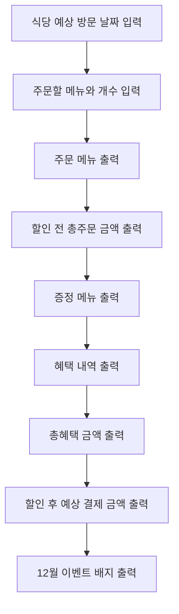

# 🧑‍🎄 미션 - 크리스마스 프로모션 (이상준)

---

## 🎄12월 이벤트 플래너 플로우 차트

---

## 🛠 구현 기능 목록
#### 1. 식당 예상 방문 날짜를 입력
- [x] 식당 예상 방문 날짜를 입력받는다.
    - **예외사항**
    - [x] 1 ~ 31 까지 숫자가 아닌경우.

#### 2. 주문 메뉴와 개수 입력
- [x] 주문할 메뉴와 개수를 입력받는다.
    - **예외사항**
    - [x] 메뉴 형식이 잘못된 경우.
    - [x] 메뉴판에 없는 메뉴를 입력하는 경우.
    - [x] 중복 메뉴를 입력한 경우.
    - [x] 음료만 주문하는 경우.
    - [x] 메뉴의 개수가 20개를 초과한 경우.

#### 3. 주문 메뉴 출력
- [x] 주문 메뉴를 세로로 출력한다.

#### 4. 할인 전 총 주문 금액
- [x] 주문 메뉴의 가격을 모두 계산해서 출력한다.

#### 5. 증정 메뉴 출력
- [x] 증정 메뉴를 출력한다.
- [x] 증정 메뉴가 없으면 '없음'으로 출력한다.

#### 6. 혜택 내역 출력
- [x] 고객에게 적용된 이벤트 내역만 출력한다.
    - [x] 크리스마스 디데이 할인.
    - [x] 평일 할인.
    - [x] 특별 할인.
    - [x] 증정 이벤트.
- [x] 혜택 내역이 없으면 '없음'으로 출력한다.

#### 7. 총 혜택 금액 출력
- [x] (할인 금액의 합계 + 증정 메뉴의 가격)을 출력한다.

#### 8. 할인 후 예상 결제 금액 출력
- [x] (할인 전 총주문 금액 - 크리스마스 디데이 할인 - 평일 할인 - 특별 할인)을 출력한다.

#### 9. 12월 이벤트 배지 출력
- [ ] 혜택 금액에 따라 배지를 출력한다.
    - [ ] 5천원 이상: 별, 1만원 이상: 트리, 2만원 이상: 산타
- [ ] 배지가 없으면 '없음'으로 출력한다.